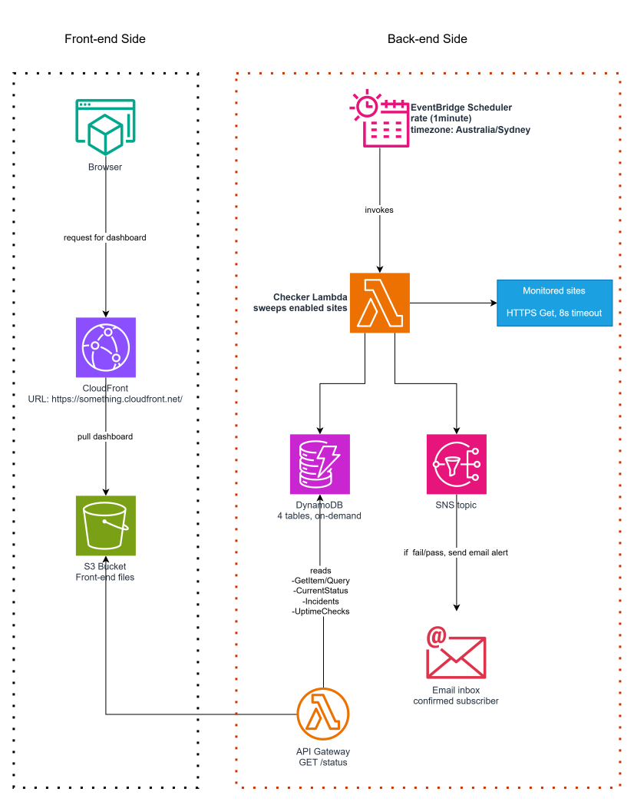

# MuBWeM — Multi-Brand Website Monitor

**MuBWeM** = **Mu**lti-**B**rand **We**bsite **M**onitor: one uptime monitor watching the websites of several brands from a single dashboard.

An UptimeRobot-style uptime monitor built on AWS with CDK (Python). It checks a list of sites every minute, records every check, opens and closes incidents, emails you when something goes down or recovers, and serves a static status dashboard from CloudFront.

The dashboard is behind a Cognito login. Individual sites can be flagged `isPublic` to also appear on a shareable status page that needs no login — the UptimeRobot public-status-page idea, opt-in per site.

Access is role based: **Admins**, **Editors** and **Viewers** are Cognito groups, and an admin panel manages users and sites from the browser instead of the AWS CLI. See [Roles and access control](#roles-and-access-control).

This repo is **Phase 1: the free tier test build**. It is a portfolio project — no real company data, no hardcoded secrets, no hardcoded email addresses or ARNs anywhere in committed code.

---

## Architecture



*Diagram source: `docs/mubwem.drawio` — open with [draw.io](https://app.diagrams.net) or the draw.io desktop app to edit.*

> **TODO — the diagram is further out of date than it was.** It still shows
> the pre-authentication topology: the warning markers on the CloudFront and
> `/status` edges, and no Cognito at all. It needs a user pool feeding a JWT
> authorizer in front of `GET /status`, and the second unauthenticated
> `GET /public/status` edge.
>
> Role-based access has since added more that is missing entirely: three
> Cognito **user pool groups** (Admins / Editors / Viewers), a second
> **AdminFunction** Lambda with its own IAM role, the eight `/admin/*` routes
> behind the same JWT authorizer, and that Lambda's two arrows — one to the
> Sites table, one to the Cognito user pool.
>
> The dashboard overhaul added more again: two further status routes
> (`GET /status/{siteId}` behind the authorizer, `GET /public/status/{siteId}`
> open), and seven pages hanging off CloudFront rather than three — dashboard,
> monitor detail, incidents, monitors, team members, settings, integrations,
> plus the public page.
>
> Edit `docs/mubwem.drawio` and re-export `docs/mubwem.drawio.svg` over the top.

### The four tables

All four are **on-demand (PAY_PER_REQUEST)**.

`isPublic` is an application-level field, not a DynamoDB constraint — the table is schemaless past its keys. It defaults to `false`, and only `true` puts a site on the unauthenticated public page.

| Table | Keys | What it holds |
|---|---|---|
| **Sites** | PK `siteId` | `name`, `url`, `brand`, `checkIntervalSec`, `enabled`, `isPublic`, `createdAt` — the monitoring list, managed from the admin panel or seeded from `config/config.json` |
| **UptimeChecks** | PK `siteId`, SK `checkedAt` (ISO8601) | `statusCode`, `isUp`, `responseTimeMs`, `region`, `ttl` — the raw history, auto-expired after 30 days by DynamoDB TTL |
| **CurrentStatus** | PK `siteId` | `currentStatus` (`up`/`down`), `lastCheckedAt`, `lastResponseTimeMs`, `consecutiveFailures`, `lastStatusChangeAt` — the one row the dashboard reads per site |
| **Incidents** | PK `siteId`, SK `startedAt` (ISO8601) | `endedAt` (null while ongoing), `durationSec`, `triggerReason`, `resolved` |

### Checker flow

`lambda/checker/handler.py` runs once a minute:

1. Scans **Sites** and keeps the enabled ones.
2. Checks each site in parallel (up to 10 at a time) with an HTTPS GET, timeout from `checkTimeoutSec`. `2xx`/`3xx` is up; anything else — including a timeout, DNS failure, or TLS error — is down.
3. Writes a row to **UptimeChecks** with a 30-day TTL.
4. Updates **CurrentStatus** with a single atomic DynamoDB expression: `consecutiveFailures + 1` on failure, `0` on success.

### Alert flow

5. When `consecutiveFailures` reaches the threshold (default **3**, i.e. ~3 minutes down) **and** no incident is already open, it opens an **Incident** and publishes a `DOWN` alert to SNS.
6. On the first success after an open incident, it sets `endedAt` and `durationSec`, marks the incident `resolved`, and publishes a `RECOVERED` alert.

Requiring three consecutive failures is what keeps a single flaky check from paging you. Requiring "no incident already open" is what keeps a two-hour outage from sending an email every minute.

### Dashboard

`lambda/api/handler.py` serves two routes from one function, returning every site's current status, 24-hour uptime percentage, and its five most recent incidents in a single JSON document — the exact shape is documented in a comment at the top of that file:

| Route | Auth | Sites returned | Page |
|---|---|---|---|
| `GET /status` | Cognito JWT (API Gateway authorizer) | all of them | `index.html` |
| `GET /status/{siteId}` | Cognito JWT | one, with full detail | `monitor.html` |
| `GET /public/status` | none | only `isPublic: true` | `public.html` |
| `GET /public/status/{siteId}` | none | one, only if `isPublic` | — |

The list routes carry a top-level `summary` object (up/down/paused counts, weighted 24h uptime, MTBF, time since the last incident, incidents in the last 24h) and a 24-slot `hourlyBuckets` array per site. Both are computed from data the response was already assembling — the buckets come out of the same 24h `UptimeChecks` query the uptime percentage uses, so adding them cost no extra reads.

The detail routes add the raw 24h check series for the response-time graph, thinned by regular-interval sampling to at most 500 points (never truncated — truncation would quietly turn a 24-hour graph into an 8-hour one), plus up to 50 incidents instead of the list view's 5.

On the public detail route, a site that is private and a site that does not exist return **the same 404 with the same body**, so it cannot be used to discover which site ids exist.

A site with `enabled: false` now reports `status: "paused"` rather than whatever `CurrentStatus` last recorded. Previously a paused site kept showing its last known status and was counted as operational in the header — that miscount is what `pausedCount` and the `paused` status fix.

`lambda/admin/handler.py` is a **separate** function behind the same JWT authorizer, serving the admin panel:

| Route | Minimum role | What it does |
|---|---|---|
| `GET /admin/sites` | Editor | every site, admin view |
| `POST /admin/sites` | Editor | create a site (starts disabled and private) |
| `PATCH /admin/sites/{siteId}` | Editor | edit `name`, `url`, `brand`, `checkIntervalSec`, `enabled`, `isPublic` |
| `DELETE /admin/sites/{siteId}` | **Admin** | delete the Sites row |
| `GET /admin/users` | **Admin** | list users and their role |
| `POST /admin/users` | **Admin** | create a user in a role |
| `PATCH /admin/users/{username}` | **Admin** | change a user's role, enable/disable them |
| `DELETE /admin/users/{username}` | **Admin** | delete a user |

Two functions rather than more routes on one: the status API is reachable anonymously on `/public/status`, and giving that same function the ability to administer the user pool would be handing a capability to the one Lambda anyone can reach without a token. `AdminFunction` gets its own IAM role, read/write on **Sites only** — not UptimeChecks, CurrentStatus or Incidents — plus eight `cognito-idp` actions scoped to this user pool's ARN.

Both responses have the same shape, so one renderer (`frontend/dashboard.js`) serves both pages; `public.html` is styled distinctly so it is obvious which view you are looking at. The filter runs before any per-site work, so a site the caller will not see costs no `UptimeChecks` or `Incidents` read. `isPublic` itself is never echoed back on either route.

`frontend/` is plain HTML/CSS/JS with no build step; the status pages poll every 20 seconds and render one card per site, down sites first.

### Pages

A persistent side navigation (`nav.js`) is shared by every authenticated page. **Team Members** and **Monitors** are shown only to Admins and Editors — display-level routing, enforced server-side as always.

| Page | Who | What |
|---|---|---|
| `index.html` | any signed-in user | A toolbar (search, status, brand, density) over two summary cards and a grid of monitor cards. Each card carries the status badge, the countdown ring, a 24-bar hourly history and the 24h uptime percentage, and links through to the detail page. |
| `monitor.html?site=<siteId>` | any signed-in user | One monitor: the large hourly bar, the four detail stats that used to sit on the card, a Chart.js response-time graph over the last 24h, and up to 50 incidents. Admins and Editors additionally get an **Edit** form that `PATCH`es `/admin/sites/{siteId}`; a Viewer sees no edit control at all, not a disabled one. |
| `incidents.html` | any signed-in user | Flat cross-site incident list, newest first, with a client-side filter by monitor. |
| `sites.html` | Admins, Editors | Monitor management: the enable/public toggles, the add-site form, and (Admins only) delete. |
| `team.html` | Admins | User management. An Editor reaching it is told why there is nothing to see. |
| `settings.html` | any signed-in user | **Stub.** Read-only view of deploy-time configuration. |
| `integrations.html` | any signed-in user | **Stub.** The API URLs and a `curl` example. No integrations exist. |
| `public.html` | nobody signs in | The shareable status page. Same toolbar and summary as the dashboard, and it keeps the stats and incident list on the card, since it has no detail page to link to. |

#### Dashboard controls

The toolbar filters the `/status` document the page is **already** polling: a text search over name, URL and brand; a status segment (All / Up / Down / Paused) whose counts come from the payload's `summary`; one chip per brand; and a card/list density toggle. None of it issues a request, and none of it needed a backend change — which is why there is no `?q=` or `?status=` parameter on any route.

Filtering never re-sorts. The API returns sites down-first then by name, and that ordering survives every filter, which is also why brands are chips rather than grouped sections. The two summary cards keep describing the whole deployment even when a filter is narrowing the grid — they are the deployment roll-up, not a view of what is on screen — and a "Showing 3 of 8 monitors" line makes the filtered subset explicit. The status filter and density are remembered in `localStorage`; the search text and brand are not.

`settings.html` and `integrations.html` are **placeholders, shipped as placeholders**. Neither has a control that changes anything, and both say so on the page. There is nothing behind them to configure yet: alerting is one SNS topic with one email subscription fixed at deploy time, and there are no webhooks, API keys or third-party targets. See the [roadmap](#roadmap-later-phases).

Each card carries a small SVG ring counting down to that site's next check. It is drawn from `lastCheckedAt` in the `/status` payload plus `scheduleIntervalSec` (published in the deploy-generated `config.js`, derived from the same `scheduleExpression` that drives EventBridge Scheduler), and it ticks once a second rather than once per 20-second poll so it moves smoothly. It is an **approximation**: the browser gets no live signal from EventBridge, so the ring shows where the next tick should land if the sweep keeps its cadence, not when it will actually fire.

The frontend never has the API URL or the Cognito client details committed to git: the CDK stack generates a `config.js` at deploy time and uploads it alongside the static files.

### Login

`frontend/auth.js` runs the OAuth 2.0 authorization code flow with PKCE against the Cognito hosted UI. The app client is public — a static page cannot keep a secret — so PKCE is what stops an intercepted code from being redeemed by anyone else.

The id token is kept in `sessionStorage`, never `localStorage`, and no refresh token is stored at all. A `localStorage` token survives every tab and outlives the browsing session, which turns any XSS on a page showing real internal hostnames into a durable credential leak; `sessionStorage` dies with the tab. The cost is re-authenticating on a new tab and once an hour when the id token expires, which the hosted UI's own session cookie usually makes invisible.

---

## Tradeoffs (the honest version)

- **Single region for checking.** Every check runs from `ap-southeast-2` (Sydney). The target audience is Australian, so this measures what those users actually experience. The cost is that a network problem between AWS Sydney and a site looks identical to that site being down — a real multi-region monitor would check from several regions and require a quorum before alerting.
- **1-minute check interval, now enforced at write time.** One minute is the floor for EventBridge Scheduler. Sub-minute checking would need a different trigger (a Step Functions loop, or a long-running container), which is more moving parts than a free tier test build justifies.

  This used to be documentation only: `checkIntervalSec` accepted anything from 30s upward, and the checker ignored it entirely — it sweeps every enabled site on every invocation and compares the field against nothing. A site set to 30s was therefore checked once a minute, not twice, and once the dashboard started drawing each card's countdown from the site's own interval, a 30s site ran two ring cycles per real check. That looks like it is working, which is worse than a ring that obviously is not.

  `POST`/`PATCH /admin/sites` now reject anything below 60 with a 400 explaining why, both site forms carry `min="60"` and an inline note, and `intervalFor()` in `dashboard.js` clamps to 60 so a row written before this rule cannot reproduce the double cycle. **Existing rows are not migrated** — a site already sitting at 30 keeps that value in DynamoDB until someone saves it through the edit form, which will then refuse it until it is corrected. The field is still not *honoured*: every enabled site is checked every minute regardless of what its interval says. Enforcing the floor only stops the value being a lie in the other direction.

  `scripts/seed_sites.py` does not apply this floor — it is the one remaining path that can write a sub-60 value.
- **On-demand DynamoDB billing.** At a handful of sites and one check per minute, the write volume is trivial and on-demand costs cents. Provisioned capacity would be marginally cheaper at steady state but adds capacity planning and autoscaling config for no real benefit at this scale.
- **A DynamoDB `Scan` on the Sites table each run.** Correct at tens of rows, where every row is needed anyway. At thousands of sites this becomes the first thing to fix — a GSI on `enabled`, or sharded scheduling.
- **Uptime % is computed on read** from up to 24 hours of check rows. Simple and always accurate, but the API's cost grows with the retention window; a rollup table would be the next step.
- **Public exposure is opt-in per site, not per deployment.** The dashboard and `GET /status` both require a Cognito login; `GET /public/status` and `public.html` are deliberately open, and show only sites flagged `isPublic`. See [Access control](#access-control-authenticated-dashboard-opt-in-public-page) for what that does and does not protect.
- **Deleting a site does not delete its history.** `DELETE /admin/sites/{siteId}` removes the Sites row only; UptimeChecks and Incidents rows for that site are left orphaned. They are harmless, checks age out on their own TTL, and cascading a delete across two partition keys is more machinery than this feature earns.
- **`removalPolicy: DESTROY`** on the tables, the bucket and the Cognito user pool. This is a test build meant to be torn down cleanly, dashboard accounts included. Anything real should use `RETAIN`.

---

## Roles and access control

Three Cognito **user pool groups**, created by the stack. A user's group arrives in their id token as the `cognito:groups` claim.

| Role | Sites | Users | Dashboard |
|---|---|---|---|
| **Admins** | create, edit, **delete** | create, change role, enable/disable, delete | yes |
| **Editors** | create, edit (`name`, `url`, `brand`, `checkIntervalSec`, `enabled`, `isPublic`) — **no delete** | no access | yes |
| **Viewers** | no access | no access | yes, read-only |

A Viewer has no access to any `/admin/*` route at all, not even a read-only one. An Editor who needs a site to stop being checked turns its `enabled` toggle off rather than deleting it — deletion has a larger blast radius, so it stays with Admins.

Group precedence is `Admins` 1, `Editors` 10, `Viewers` 20 (lower wins), so a user who somehow ends up in more than one group resolves predictably.

### Where the enforcement actually is

The API Gateway JWT authorizer in front of `/admin/*` establishes exactly one thing: the caller holds a valid, unexpired id token from this user pool and app client. **It knows nothing about groups.**

Every group decision is made inside `lambda/admin/handler.py`, in `_user_groups()` and `_require()`. `_user_groups()` reads `cognito:groups` from the authorizer claims and returns a `set`, handling the several shapes API Gateway can deliver that claim in (a list, a comma-separated string, a bracketed string). Anything it does not understand — the claim missing, malformed, empty, the event shaped unexpectedly, an exception anywhere in the lookup — returns the **empty set**, and an empty set intersects nothing, so `_require()` answers 403. There is no path through that file where failing to determine the caller's groups results in access being granted.

Every route handler calls `_require()` first and returns immediately if it gets a response back.

`frontend/admin.js` decodes the same claim client-side to decide which controls to draw — hiding the user-management section from Editors, not rendering delete buttons for non-Admins, bouncing a Viewer back to `index.html`. That is **presentation, not security**. The token is in the browser and under the user's control; if that file drew every control for everyone, the backend would still refuse. Its only job is to avoid offering someone a button that is going to fail.

### Bootstrapping the first admin

**Read this before you get stuck on it.** Groups can only be assigned through the admin panel, and reaching the admin panel requires already being in `Admins`. The very first user therefore has no group, because at the time they were created nothing existed to assign one through — and no admin existed to grant it.

That one assignment is a manual CLI step, and there is no way around it:

```bash
aws cognito-idp admin-add-user-to-group \
  --user-pool-id <CognitoUserPoolId output> \
  --username you@example.com \
  --group-name Admins \
  --region ap-southeast-2
```

Then sign out and back in — the group lands in a **new** id token, not the one already in `sessionStorage`. After that, every further user is created and assigned a role from **Team Members** at `<DashboardUrl>/team.html`.

If you ever delete every Admin, you are back to this step. That is why an admin cannot delete or disable their own account through the panel: `_is_self()` compares the target against the caller's own `sub`, `cognito:username` and `email` claims and refuses a match with a 409.

---

## Access control: authenticated dashboard, opt-in public page

This started as a known Phase 1 gap — the dashboard URL and `/status` were both reachable by anyone holding the URL, with no authentication — identified during Phase 1 testing rather than discovered later. It is now closed as follows.

**The dashboard is login-gated by default.** A Cognito user pool with **self-signup disabled** fronts it: accounts exist only because an operator created them (see [Creating a user](#creating-a-user)). Login goes through the Cognito hosted UI, and `GET /status` sits behind an API Gateway JWT authorizer validating the id token against that pool and app client. There is no way to reach a private site's status without a token.

**Public sharing is an explicit per-site opt-in.** A site with `isPublic: true` also appears on `GET /public/status`, which has no authorizer, and on `public.html`, which is the URL to hand out. Everything else stays behind the login. The default is `false`, so a site is private unless someone says otherwise.

Of the three fixes weighed earlier, this is the third — real authentication rather than a shared credential:

1. **A CloudFront Function doing HTTP Basic Auth at the edge** was the fastest to add and the weakest as access control: one shared credential, sent on every request, with no per-user identity or revocation. Not used.
2. **AWS WAF with an IP allowlist in front of CloudFront** is stronger where access should be limited to known office or VPN ranges, but needs a second stack in `us-east-1` — a WAF web ACL attached to CloudFront must live there regardless of which region the distribution is configured from. Not used; still the right addition if you want network-level restriction *as well*.
3. **Identity-based auth** — the option taken. Cognito gives per-user identity, revocation (disable or delete the user) and password policy, and the same JWT authorizer swaps to an organizational IdP later: federate the user pool to your SSO provider and neither the API nor the frontend changes.

### What this still does not do

- **CloudFront itself is not access-controlled.** The static HTML, CSS and JS are downloadable by anyone with the URL. There is nothing sensitive in them — the site list, statuses and incidents all arrive from the authenticated API — but the distribution is not private, and `config.js` publishes the API URL, the Cognito domain and the public client id. That is by design for a public OAuth client, not an oversight.
- **CORS on the API is still `*`.** The JWT authorizer, not the origin header, is what protects `/status`; CORS was never doing that job. `/public/status` is meant to be open.
- **No MFA, and no logging of who looked at what.** Adequate for a portfolio build, not for anything with a compliance story.
- **`removalPolicy: DESTROY` covers the user pool too**, so `cdk destroy` takes the accounts with it.

---

## Deploy

### Prerequisites

- An AWS account and credentials configured (`aws configure`, or `AWS_PROFILE`)
- Node.js (for the CDK CLI) and Python 3.11+
- `npm install -g aws-cdk`

### 1. Install dependencies

```bash
python -m venv .venv
source .venv/bin/activate          # Windows PowerShell: .venv\Scripts\Activate.ps1
pip install -r infrastructure/requirements.txt
pip install -r scripts/requirements.txt
```

### 2. Set your configuration

Nothing environment-specific is committed. Copy the env template and fill it in:

```bash
cp .env.example .env               # .env is gitignored
```

| Setting | Env var | Context key | Default |
|---|---|---|---|
| Alert email (**required**) | `MUBWEM_ALERT_EMAIL` | `alertEmail` | none — deploy fails without it |
| Failure threshold | `MUBWEM_FAILURE_THRESHOLD` | `failureThreshold` | `3` |
| HTTP timeout (sec) | `MUBWEM_CHECK_TIMEOUT_SEC` | `checkTimeoutSec` | `8` |
| Check retention (days) | `MUBWEM_CHECKS_TTL_DAYS` | `checksTtlDays` | `30` |
| Schedule | `MUBWEM_SCHEDULE_EXPRESSION` | `scheduleExpression` | `rate(1 minute)` |
| Region | `MUBWEM_REGION` | `region` | `ap-southeast-2` |
| Cognito domain prefix | — | `cognitoDomainPrefix` | derived from the stack id |
| Check countdown (sec) | — | `scheduleIntervalSec` | derived from `scheduleExpression` |

The Cognito hosted-UI domain prefix has to be globally unique across all AWS accounts, so it defaults to `mubwem-` plus the first segment of this stack's CloudFormation id. Override it with `-c cognitoDomainPrefix=something-unique` if you want a friendlier login URL.

Any of these can also be passed on the command line, which wins over both `.env` and `cdk.json`:

```bash
cdk deploy -c alertEmail=you@yourdomain.com -c failureThreshold=3
```

### 3. Bootstrap and deploy

```bash
cd infrastructure
cdk bootstrap aws://<YOUR_ACCOUNT_ID>/ap-southeast-2
cdk synth                          # sanity check, writes nothing to AWS
cdk deploy
```

Deploy prints ten outputs:

| Output | What it is for |
|---|---|
| `DashboardUrl` | the CloudFront dashboard (login required); the public page is `<DashboardUrl>/public.html` |
| `SitesAdminUrl` | monitor management — Admins and Editors |
| `TeamAdminUrl` | user management — Admins |
| `ApiUrl` | `GET /status` — needs a Cognito id token |
| `PublicApiUrl` | `GET /public/status` — open, `isPublic` sites only |
| `AdminApiUrl` | base path for `/admin/users` and `/admin/sites` — needs a token *and* the right group |
| `CognitoLoginUrl` | the hosted UI login page |
| `CognitoUserPoolId` | needed to create the first user, and to put them in `Admins` (below) |
| `SitesTableName` | used by `scripts/seed_sites.py` |
| `AlertTopicArn` | the SNS topic behind the email alerts |

### 4. Confirm the SNS email subscription

AWS sends a "Subscription Confirmation" email to the address you configured. **Click the confirmation link** — until you do, no alerts are delivered. Check spam if it does not arrive within a minute.

### 5. Seed your sites

```bash
cp config/config.example.json config/config.json     # config.json is gitignored
# edit config/config.json with your real test sites
python scripts/seed_sites.py --dry-run              # check what will be written
python scripts/seed_sites.py                        # write to the Sites table
```

The script finds the table name from the stack's `SitesTableName` output, so no table name or ARN is ever hardcoded. Re-running it updates existing sites while preserving their original `createdAt`; `--prune` also deletes sites that are no longer in the config.

Add `"isPublic": true` to a site to put it on the public status page. It defaults to `false`, and a re-seed from a config that does not mention `isPublic` leaves whatever the table already says alone — the same treatment `createdAt` gets — so a site does not quietly stop being public because someone trimmed the config. Spelling the flag out explicitly always wins, including `"isPublic": false` to un-publish.

The checker picks up the new sites on its next run, within a minute.

Seeding is now optional: once you have an Admin (see [Bootstrapping the first admin](#bootstrapping-the-first-admin)), sites are added and edited from the **Monitors** page instead. `seed_sites.py` remains the way to load a list in bulk, and to keep a config file as the source of truth.

### 6. Open the dashboard

Visit the `DashboardUrl` output and sign in with a user you created (see [Creating a user](#creating-a-user) — there is no self-signup, so do this first). CloudFront can take a few minutes to finish deploying on first launch.

The shareable public page is `<DashboardUrl>/public.html`. It needs no login and lists only the sites flagged `isPublic`.

Monitor management is `<DashboardUrl>/sites.html` and user management is `<DashboardUrl>/team.html` (both printed as stack outputs). They appear in the side navigation for anyone whose token carries `Admins` or `Editors`; a Viewer never sees the links, and is redirected to the dashboard if they navigate there anyway.

Running the frontend locally is only useful for the public page now, because the Cognito app client's callback URL is the CloudFront domain:

```bash
cd frontend && python -m http.server 8000
# then open http://localhost:8000/public.html?api=<PublicApiUrl output>
```

To develop the authenticated page locally as well, add `http://localhost:8000/` to the app client's callback **and** sign-out URLs in the Cognito console — or to `callback_urls` / `logout_urls` in the stack, if you would rather it be code.

### Tearing down

```bash
cd infrastructure && cdk destroy
```

Tables, the frontend bucket and the user pool are set to `DESTROY`, so this leaves nothing behind — including the dashboard accounts.

---

## Creating a user

**The admin panel is the normal path.** Once there is at least one Admin, users are created and given a role on the **Team Members** page at `<DashboardUrl>/team.html` — email plus a role dropdown, no CLI. Cognito emails the new user a temporary password (generated server-side in `lambda/admin/handler.py`, never accepted from the browser) and they set a real one on first hosted-UI login.

The CLI below is **bootstrap only**: it is how the very first account comes into existence, before an admin panel is reachable by anyone. Self-signup is deliberately off, so nobody gets a dashboard account except by an operator creating one.

### Bootstrap: the first user


```bash
aws cognito-idp admin-create-user \
  --user-pool-id <CognitoUserPoolId output> \
  --username you@example.com \
  --user-attributes Name=email,Value=you@example.com Name=email_verified,Value=true \
  --temporary-password "TempPass123!" \
  --region ap-southeast-2
```

Cognito emails the temporary password to that address. On the first hosted-UI login the user is prompted to set a permanent one, which must satisfy the pool's policy: at least 8 characters with an uppercase letter, a lowercase letter and a digit.

Add `--message-action SUPPRESS` if you would rather hand the temporary password over yourself instead of having Cognito email it.

That user now exists but is in **no group**, so they can sign in to the dashboard and see nothing else. Put them in `Admins` with the one-off step in [Bootstrapping the first admin](#bootstrapping-the-first-admin) — that CLI call cannot be done through the UI, because no admin exists yet to grant it. Every user after this one goes through the admin panel.

### Revoking access

Disable or delete the user from the **Team Members** table. Or, from the CLI:

```bash
aws cognito-idp admin-disable-user --user-pool-id <id> --username you@example.com --region ap-southeast-2
```

---

## Repository layout

```
mubwem/
├── infrastructure/         CDK app (Python)
│   ├── app.py              entrypoint; resolves config from CLI / .env / cdk.json
│   ├── stacks/mubwem_stack.py
│   ├── cdk.json            context block with placeholder values
│   └── requirements.txt
├── lambda/
│   ├── checker/handler.py  runs every minute, checks all sites, alerts
│   ├── api/handler.py      the four /status routes, list and detail
│   └── admin/handler.py    /admin/* — group checks, site CRUD, user management
├── frontend/               static pages (no framework, no build step)
│   ├── index.html          dashboard: summary cards + monitor grid
│   ├── monitor.html        one monitor: hourly bar, response graph, incidents, edit
│   ├── incidents.html      cross-site incident list
│   ├── sites.html          monitor management (Admins, Editors)
│   ├── team.html           user management (Admins)
│   ├── settings.html       stub: read-only deploy config
│   ├── integrations.html   stub: API URLs, no integrations
│   ├── public.html         shareable public status page
│   ├── auth.js             Cognito hosted UI login (auth code + PKCE)
│   ├── nav.js              the shared side navigation
│   ├── shell.js            per-page bootstrap: auth, nav, fetch, formatting
│   ├── dashboard.js        monitor-card rendering, shared by index and public
│   └── *.js                one bootstrap module per page
├── config/
│   ├── config.example.json committed placeholders
│   └── config.json         gitignored — your real sites
├── scripts/seed_sites.py   seeds the Sites table from config.json
└── LICENSE                 MIT
```

## Roadmap (later phases)

- Multi-region checks with quorum before alerting
- Historical uptime rollups instead of computing 24h uptime on every read
- SSL certificate expiry and keyword-match checks
- Per-site alert routing (Slack, SMS) and maintenance windows
- Federating the Cognito pool to organizational SSO, and WAF/IP restriction in front of CloudFront
- Honouring per-site `checkIntervalSec` instead of a fixed one-minute sweep
- An audit log of admin actions — who changed which site or role, and when
- **Settings (`settings.html`) is a stub.** Per-user notification preferences, alert routing beyond the single SNS email, maintenance windows and per-site failure thresholds are all unbuilt. The page shows deploy-time config read-only and says so.
- **Integrations & API (`integrations.html`) is a stub.** No webhooks, no Slack/Teams/PagerDuty targets, no API keys, no published OpenAPI description. The page documents the existing routes and says so.
- **A real incident history.** `incidents.html` is assembled from the dashboard feed, which carries only the 5 most recent incidents per monitor — so it shows recent history, not a complete log. A full view needs a paginated cross-site query over the Incidents table, which is a genuine feature (unbounded reads over a table that only grows), not a tweak to that page.
